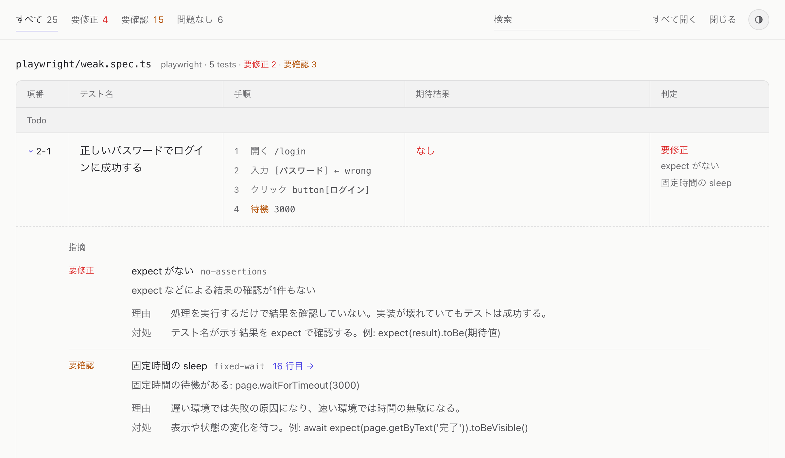
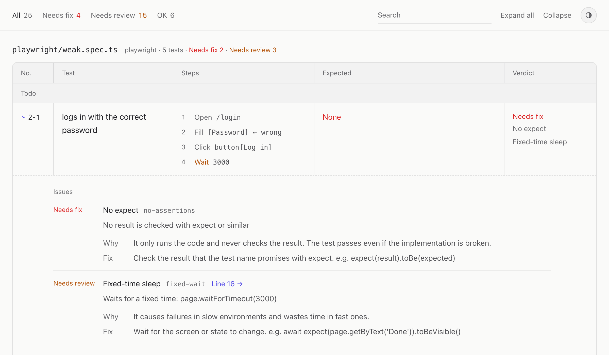

# testglass

**日本語** | [English](#english)



テストコードを**静的解析**して、人間がレビューするための「テスト仕様書」（単一ファイルの HTML。Markdown・CSV でも出力できます）を生成します。

AI にテストを書かせると、量が多く、実装まで全部は読み切れません。testglass は、せめてテストだけは人間がしっかりレビューできるように、次の観点を1画面にまとめます。

- **テスト名**（何を確かめると主張しているか）
- **手順**（実際に何をしているか）
- **期待結果**（何を検証しているか）
- **警告**（アサーションが無い、`.only` が残っている、モックの呼び出ししか見ていない、など）

「テスト名と中身が一致しているか」を、ソースを開かずに確かめられることが目的です。

```
テスト名                              手順                          期待結果              警告
正しいパスワードでログインに成功する  1. goto /login                アサーションなし      ● アサーションなし
                                      2. fill [パスワード] ← wrong                        ● 固定時間の待ち
                                      3. click button[ログイン]
                                      4. waitForTimeout 3000
```

> テストは実行しません。`it.each` のように実行時に展開されるテストは、「動的生成」の警告を出すだけです。

### ESLint との違い

警告ルールの一部（アサーションが無い、`.only` が残っている、固定時間の待ちなど）は、`@vitest/eslint-plugin` や `eslint-plugin-playwright` にも似たルールがあります。ESLint は、**コードを書く人**に向けて問題のある行を指摘します。testglass は、**テストをレビューする人**に向けて、テスト全体を「名前・手順・期待結果」の仕様書として並べます。警告は、レビューで気をつけて読むべき箇所の目印です。

ESLint とは置き換えではなく併用する想定です。書くときの指摘は ESLint で、テストが名前どおりの内容になっているかの確認は testglass で行います。

## 使い方

Node.js 22.12 以上（Bun でも動きます）。

```sh
npm i -D testglass

# テストを読んで spec.json を書き、HTML を生成する（既定の出力先は testglass/）
npx testglass

# 段階ごとに実行する
npx testglass collect --out testglass/spec.json      # ① 読む → ② JSON に保存（毎回上書き）
npx testglass render testglass/spec.json --format html  # ③ JSON から HTML を生成

# Markdown・CSV も出力する
npx testglass --format html,md,csv
```

生成された `testglass/spec.html` をブラウザで開きます。CSS・JS・データをすべて埋め込んだ単一ファイルなので、そのまま共有したり CI の成果物にしたりできます。Markdown（`spec.md`）と CSV（`spec.csv`）の中身は、[Markdown・CSV](#markdowncsv) を見てください。

### コマンド

| コマンド | 説明 |
|---|---|
| `testglass` | テストを読んで `spec.json` を書き、成果物を生成する（`collect` と `render` をまとめて実行） |
| `testglass collect` | テストを読んで `spec.json` を書く（毎回上書き）。成果物は生成しない |
| `testglass render <spec.json>` | 指定した `spec.json` から成果物を生成する。テストは読まない |
| `testglass schema` | `spec.json` の JSON Schema を出力する（`--out` を付けるとファイルに保存。パッケージの `testglass/schema.json` にも同じものが入っています） |

### オプション

「コマンド」の列にないコマンドでは、そのオプションは無視されます。

| オプション | 説明 | コマンド |
|---|---|---|
| `--root <dir>` | 解析するディレクトリ（既定: カレントディレクトリ）。`spec.json` に書くテストファイルのパスは、ここからの相対パスになる | `testglass`・`collect` |
| `--out <file>` | `spec.json`（`schema` では JSON Schema）の出力先。既定は `testglass/spec.json` で、`--root` ではなくコマンドを実行したディレクトリからの相対パス | `testglass`・`collect`・`schema` |
| `--format <names>` | 出力形式。`html` / `md` / `csv` をカンマ区切りで指定（既定: `html`） | `testglass`・`render` |
| `--out-dir <dir>` | 成果物の出力先（既定: `spec.json` と同じディレクトリ） | `testglass`・`render` |
| `--lang <lang>` | 成果物と CLI のメッセージの言語。`ja` / `en`（既定: `ja`）。設定ファイルの `lang` より優先する | すべて |
| `--config <file>` | 設定ファイル。省略すると `testglass.config.{mjs,js,json}` を、`testglass`・`collect` では `--root` から、`render` ではカレントディレクトリから探す | `testglass`・`collect`・`render` |
| `--fail-on <level>` | `error` / `warn` の警告が1件でもあれば終了コード 1 を返す（CI 用）。`warn` を指定すると、`error` があるときも 1 を返す | `testglass`・`collect`・`render` |

### HTML の構成

テスト仕様書の罫線の表を、細く薄い線と落ち着いた配色で出力します。強弱は文字の濃さで付け、色は判定（要修正・要確認）と選択中の状態にだけ使います。

- **上部の固定バー**：判定（すべて／要修正／要確認／問題なし）の切り替えと件数、検索、表示テーマ
- **見出し**：作成日時・件数、フレームワークのタブ（2種類以上あるとき）、判定ごとの指摘の一覧。指摘をクリックすると、その指摘があるテストに絞り込む。フレームワークを切り替えると、件数もそのフレームワークで数え直す
- **本文**：ファイルごとに「項番／テスト名／手順／期待結果／判定」の表を並べる。describe は表の中の区切り行になる（狭い画面では1件ずつ縦に並べる）
  - 判定は、テストについた警告のうち最も重いもので決まる（`error` → 要修正、`warn` → 要確認、警告なし → 問題なし）
  - Playwright の操作は「入力」「クリック」などの日本語で表示する（`--lang en` では Fill・Click。`spec.json` の中身はコード寄りの表記のまま）
- **行を開いた詳細**：指摘ごとに内容・理由・対処と該当行へのリンク、その下にソース（検証している行と指摘のある行に色がつく）
- ライト／ダーク（既定は OS の設定に従う）。印刷時は固定バーを隠す。`spec.html#t-<テストID>` で特定のテストを開いた状態で表示できる
- 画面の言語は日本語（既定）と英語。`--lang en` で、判定・指摘・列名・ボタンなどを英語にする（`<html lang>` も合わせる）。テスト名や `test.step` のタイトルなど、テストに書かれた文字はそのまま

### Markdown・CSV

項番・判定・手順の表記（「入力」「クリック」など）は HTML と同じです。見出しや列名も `--lang` に従います。

- **Markdown（`--format md` → `spec.md`）**：概要（件数と、判定ごとの指摘の表）のあと、ファイルごとに「項番／テスト名／手順／期待結果／判定」の表を並べる。describe ごとに見出しを立てて表を分ける。テスト名やコードに含まれる `|`・バッククォート・HTML・`$` はエスケープするので、GitHub などで表が崩れない
- **CSV（`--format csv` → `spec.csv`）**：1行 = 1テスト。列は「項番, ファイル, フレームワーク, describe, テスト名, 修飾子, 手順, 期待結果, 判定, 指摘, 行」。表計算ソフトで絞り込み・並べ替えをする用途向け
  - 手順・期待結果・指摘はセルの中で改行する。無いときは空のセルにする
  - Excel でそのまま開けるよう、BOM 付き UTF-8・改行は CRLF（`outputOptions.csv.bom: false` で BOM を外せる）
  - `=` `+` `-` `@` で始まる値は、数式として実行されないよう先頭に `'` を付ける

## 対応フレームワーク

| 入力アダプタ | 対象ファイル |
|---|---|
| `vitest` | `*.test.*` / `*.spec.*` のうち、`vitest` を import しているもの。import していなくても（globals モード）、他のランナーの import が無ければ対象にする |
| `playwright` | `@playwright/test` を import しているもの。自作 fixtures 経由（`import { test } from "./fixtures"`）でも、本体が `({ page })` などを受け取っていれば対象にする |

自動判定が外れる場合は、設定の `frameworks` でパスを指定します。

### 手順（steps）の抽出方法

手順は、LLM を使わずに構文木からルールで組み立てます。同じコードからは常に同じ結果が出ます。

**Playwright** は次の順で、最初に見つかったものを使います。

1. `test.step('…')` のタイトル（入れ子は字下げ）
2. 操作の呼び出し（`goto` / `click` / `fill` / `press` / `check` / `selectOption` / `hover` / `dragTo` / `waitForTimeout` など）

   | コード | 手順 |
   |---|---|
   | `page.goto('/login')` | `goto /login` |
   | `page.getByLabel('メール').fill('a@b.c')` | `fill [メール] ← a@b.c` |
   | `page.getByRole('button', { name: 'ログイン' }).click()` | `click button[ログイン]` |
   | `page.getByText('保存').click()` | `click text[保存]` |
   | `page.locator('.row').nth(2).click()` | `click .row >> nth(2)` |
   | `page.keyboard.press('Enter')` | `keyboard.press Enter` |

3. 上のどちらも無ければ（API テストなど）、Vitest と同じ「文の1行化」

**Vitest** は、テスト本体の直下にある文のうち、アサーション以外を上から順に1行ずつ要約します。

- 改行と余分な空白を詰め、80 文字を超える部分は `…` で省略する
- `if` / `for` / `try` などは `if (cond) { … }` のように本体を省略する
- モックの設定（`vi.fn` / `vi.spyOn` / `vi.mocked(x).mockResolvedValue(…)` など）は `mock: api.get` のように対象だけを示す
- コメントは手順にしません。AI が書いた「それらしいコメント」をそのまま信じないためです。コメントは、行を展開したときのソースで確認できます
- ヘルパー関数の中までは追いません（`login(page)` はそのまま1行で出ます）

## 警告ルール

| ルール | 既定 | 内容 |
|---|---|---|
| `no-assertions` | error | アサーション（expect など）が1件もない（`.todo` は除く） |
| `focused-test` | error | `.only` が残っている |
| `skipped-test` | warn | `.skip` / `.fixme` / `.todo` が残っている（`describe.skip` の配下も含む） |
| `weak-assertions-only` | warn | `toBeTruthy` / `toBeFalsy` / `toBeDefined` / `not.toBeNull` など、真偽・存在の確認だけで検証している |
| `snapshot-only` | warn | スナップショット（`toMatchSnapshot` / `toHaveScreenshot` など）の比較だけで検証している |
| `mock-calls-only` | warn | `toHaveBeenCalledWith` などモックの呼び出し検証だけで、結果（戻り値や状態）を見ていない |
| `conditional-assertion` | warn | `if` / 三項演算子 / `&&` / `switch` / `catch` の中にアサーションがあり、実行されない場合がある |
| `fixed-wait` | warn | `waitForTimeout(…)` / `sleep(1000)` / `new Promise(r => setTimeout(r, …))` などの固定時間の待ち |
| `dynamic-test` | warn | `it.each` / `test.for`、ループの中での宣言、式で組み立てたテスト名、本体に関数参照を渡しているもの。静的解析では展開しない |
| `duplicate-title` | warn | 同じ describe の中に同名のテストがある |
| `duplicate-body` | warn | 本体（コメント・空白を除く）が同一のテストがある（ファイルをまたいで判定） |

## 設定

ルートに `testglass.config.json`（または `.mjs` / `.js`）を置きます。

```json
{
  "include": ["src/**/*.test.ts", "e2e/**/*.spec.ts"],
  "exclude": ["**/node_modules/**"],
  "frameworks": { "playwright": ["e2e/**"] },
  "rules": {
    "snapshot-only": "off",
    "fixed-wait": "error"
  },
  "out": "docs/testglass/spec.json",
  "format": ["html"],
  "lang": "ja",
  "outputOptions": { "html": { "title": "決済サービスのテスト仕様書" } }
}
```

| キー | 説明 |
|---|---|
| `include` / `exclude` | 解析対象の glob（既定: `**/*.{test,spec}.{ts,tsx,mts,cts,js,jsx,mjs,cjs}`。`node_modules` / `dist` / `build` / `coverage` は除外） |
| `frameworks` | アダプタ名 → そのアダプタで必ず解析するファイルの glob（自動判定より優先） |
| `rules` | ルールID → `"off"` / `"warn"` / `"error"`。未知の ID はエラーになる |
| `out` / `outDir` | `spec.json` と成果物の出力先（ルートからの相対） |
| `format` | 出力形式（`html` / `md` / `csv`） |
| `lang` | 成果物と CLI のメッセージの言語（`ja` / `en`。既定: `ja`）。すべての出力形式（独自の出力アダプタを含む）のオプションに `lang` として渡す |
| `outputOptions` | 出力形式ごとのオプション（`html` と `md` は `title` と `fileName`、`csv` は `fileName` と `bom`） |
| `inputAdapters` / `outputAdapters` | 独自のアダプタ（JS の設定ファイルでのみ指定できる） |

## 中間 JSON（spec.json）

処理は「① テストを読む → ② 中間 JSON に保存 → ③ JSON から成果物を生成」の3段構成です。`spec.json` は毎回その時点の断面で**上書き**し、履歴は持ちません。差分が必要なら、2つの `spec.json` を比べます。

```json
{
  "schemaVersion": 1,
  "generatedAt": "2026-09-29T10:00:00+09:00",
  "files": [
    {
      "path": "tests/e2e/login.spec.ts",
      "framework": "playwright",
      "tests": [
        {
          "id": "ef8980122ef91742",
          "suites": ["ログイン"],
          "title": "正しいパスワードで成功する",
          "location": { "line": 12, "column": 3 },
          "modifiers": [],
          "steps": ["ログイン画面を開く", "認証情報を入力"],
          "assertions": [{ "line": 20, "text": "expect(page).toHaveURL('/home')" }],
          "warnings": [],
          "source": "test('正しいパスワードで成功する', async ({ page }) => { … })",
          "fingerprint": "5d0c5e1f2a9b7c30"
        }
      ]
    }
  ]
}
```

| フィールド | 説明 |
|---|---|
| `files[].path` | ルートからの相対パス（`/` 区切り）。`files` はパスの昇順 |
| `files[].framework` | 解析した入力アダプタの名前 |
| `tests[].id` | 「ファイルパス＋describe 階層＋テスト名」のハッシュ。テスト名が変われば別のテストになる。同名のテストが複数あるときは、2件目以降に出現順の番号を加えて計算する |
| `tests[].suites` | 外側から順の describe のタイトル |
| `tests[].location` | テスト宣言の位置（行・列とも1始まり） |
| `tests[].modifiers` | `"skip"` / `"only"` / `"todo"` / `"each"`。外側の describe から引き継いだものも含む。Playwright の `fixme` は `"skip"` |
| `tests[].steps` | 手順（上記のルールで要約したもの）。`test.step` の入れ子は先頭の空白2つ分ずつ字下げする |
| `tests[].assertions` | アサーションの行と式（空白は詰める）。`test.step` やコールバックの中にあるものも含む |
| `tests[].warnings` | `{ rule, severity, line?, detail? }`。`line` は警告の根拠になった行。表示する文言は持たず、出力のときに `rule` と `detail` から組み立てる（`warningMessage(warning)` で取り出せる） |
| `tests[].warnings[].detail` | ルールごとの詳細。`reason`（`skipped-test` の `skip` / `todo`、`dynamic-test` の `each` / `loop` / `title` / `body`）、`code`（`fixed-wait` の待機しているコード）、`lines`（`duplicate-title` の同名のテストの行）、`tests`（`duplicate-body` の本体が同一のテスト。`{ path, title, line }`） |
| `tests[].source` | テスト宣言全体のソース（字下げは戻してある） |
| `tests[].fingerprint` | 本体をコメント・空白を除いて正規化したハッシュ（任意）。重複検出に使う。2断面の比較で「名前だけ変わったテスト」を追跡するのにも使える |

型定義は `import type { SpecJson } from "testglass"`、JSON Schema は `testglass/schema.json` から使えます。

## アダプタの追加

入力も出力もアダプタ方式です。フレームワークや出力形式は、アダプタを1つ足すだけで増やせます。

```ts
export interface InputAdapter {
  name: string;                                      // "vitest" | "playwright" | ...
  match(filePath: string, source: string): boolean;  // 対象ファイルか判定
  parse(filePath: string, source: string): TestFile; // 共通形式に変換
}

export interface OutputAdapter<Options = unknown> {
  name: string;                                      // "html" | "md" | "csv" | ...
  render(spec: SpecJson, options?: Options): { path: string; content: string }[];
}
```

`match` がパスに加えてソースも受け取るのは、Vitest と Playwright がどちらも `*.spec.ts` を使い、import 元を見ないと区別できないためです。

### 出力アダプタの例（要修正のテストの一覧）

項番・判定・手順の表記を組み込みの出力と揃えたいときは、`reportCases()`（項番と判定を付けたテスト）、`stepLines()`（番号付きの手順）、`ruleLabel()`（指摘の表示名）、`warningMessage()`（指摘の文言）などを使います。

`--lang` や設定の `lang` で選んだ言語は、`render` の第2引数（オプション）の `lang` に入っています。`ruleLabel(rule, lang)` のように渡すと、組み込みの出力と同じ言語で表示できます。判定名などの文言は `getMessages(lang)` で取り出せます。

```js
// testglass.config.mjs
import { defineConfig, reportCases, ruleLabel } from "testglass";

const todo = {
  name: "todo",
  render(spec, options = {}) {
    const lines = reportCases(spec)
      .flat()
      .filter((c) => c.verdict === "error")
      .map((c) => `- [ ] ${c.no} ${c.test.title}（${c.test.warnings.map((w) => ruleLabel(w.rule, options.lang)).join("、")}）`);
    return [{ path: "todo.md", content: `${lines.join("\n")}\n` }];
  },
};

export default defineConfig({ format: ["html", "todo"], outputAdapters: [todo] });
```

### 入力アダプタの作り方

入力アダプタは `TestFile` を返せば何を使って解析してもかまいません。ただし、警告ルールを自分で実装する必要はありません。テストごとに解析した「事実」（`TestFacts`）を `createTestCase()` に渡すと、ID の計算と警告ルールの評価をまとめて行います。ルールは AST ではなくこの事実を見て判定するので、言語が違っても同じルールがそのまま働きます。

```ts
import { createTestCase, type InputAdapter } from "testglass";

export const myAdapter: InputAdapter = {
  name: "pytest",
  match: (path) => /(^|\/)test_.*\.py$/.test(path),
  parse(path, source) {
    const tests = parsePython(source).map((t) =>   // parsePython は tree-sitter などで自作する
      createTestCase({
        path,
        suites: t.classNames,
        title: t.name,
        location: { line: t.line, column: t.column },
        modifiers: t.skipped ? ["skip"] : [],
        steps: t.statements,
        source: t.source,
        assertions: t.asserts.map((a) => ({
          line: a.line,
          text: a.text,
          kind: "value",                // "value" | "truthiness" | "snapshot" | "mock-call" | "helper"
          conditional: a.insideIf,
        })),
        fixedWaits: t.sleeps,           // time.sleep(1) など
        dynamic: t.parametrized ? [{ reason: "each", line: t.line }] : [],
        bodyResolved: true,
        normalizedBody: t.normalizedBody, // コメント・空白を除いた本体（重複検出用）
      }),
    );
    return { path, framework: "pytest", tests };
  },
};
```

JS/TS 系のランナー（jest、bun test など）なら、組み込みの解析器を `createJsAdapter()` で再利用できます。違いは、import 元のモジュール名と、宣言に使う名前・modifier の対応だけです。

```ts
import { createJsAdapter, importsAny, JS_TEST_FILE, statementSteps } from "testglass";

export const bunAdapter = createJsAdapter({
  name: "bun",
  profile: {
    modules: ["bun:test"],
    testNames: ["it", "test"],
    suiteNames: ["describe"],
    suiteProperties: [],
    chainProperties: { skip: "skip", only: "only", todo: "todo", each: "each", if: null, skipIf: null },
  },
  match: (path, source) => JS_TEST_FILE.test(path) && importsAny(source, ["bun:test"]),
  steps: ({ body }) => statementSteps(body),
});
```

作ったアダプタは、設定ファイルの `inputAdapters` / `outputAdapters` に登録します。登録したアダプタは組み込みのものより先に判定されます。

## プログラムから使う

```ts
import { collect, csvAdapter, htmlAdapter, markdownAdapter } from "testglass";

const { spec, unmatched } = await collect({ root: process.cwd(), rules: { "fixed-wait": "error" } });
const [html] = htmlAdapter.render(spec, { title: "テスト仕様書" });
const [htmlEn] = htmlAdapter.render(spec, { lang: "en", fileName: "spec.en.html" });
const [md] = markdownAdapter.render(spec);
const [csv] = csvAdapter.render(spec, { bom: false });
```

ファイルシステムを使わずに解析したい場合は、`buildSpec([{ path, source }], options)` を使います。

設定の誤りなど testglass が投げるエラーは `TestglassError` で、`message` は日本語です。`errorMessage(error, "en")` で英語の文言を取り出せます。種類と値は `error.detail` に入っています。

## 設計メモ

- JS/TS の解析には TypeScript Compiler API（`typescript@6`）を使っています。TypeScript 7（ネイティブ版）の JS API はまだ `unstable` なので、安定するまでは 6 系に固定します。利用するプロジェクト側の TypeScript のバージョンには影響しません。
- Java や Python などに広げるときは、tree-sitter で言語ごとの解析ルールを持つ入力アダプタを作る想定です（[neotest](https://github.com/nvim-neotest/neotest) と同じ方式）。
- 将来の拡張（GitHub の該当行へのリンク、2断面の差分表示、レビューのチェック状態）は、アダプタと別ファイルで追加します。レビューのチェック状態は `spec.json` の上書きで消えないよう、テスト ID で紐づけた別ファイルに保存します。

## 開発

```sh
npm install
npm test          # Vitest
npm run typecheck
npm run lint      # Biome（整形の差分は npm run format で直す）
npm run build
npm run demo      # test/fixtures から demo/spec.html、examples/en から英語の demo/en/spec.html を生成
npm run verify    # lint・型チェック・テスト・ビルド・デモ生成をまとめて実行
```

`test/fixtures/` には「良いテスト」と「警告が出るべきテスト」のサンプルがあり、`test/rules.test.ts` で各テストに出るべき警告を表にして検証しています。`examples/en/` はその英語版（英語のデモ用）で、テスト名や画面の文字だけを訳しています。`test/examples.test.ts` で、両者の解析結果（警告のルール・重大度・行など）が一致することを確かめています。fixtures を変えたときは、examples/en も合わせて直してください。

## ライセンス

MIT

---

## English

[日本語](#testglass) | **English**



testglass **statically analyzes** your test code and generates a "test specification" for human review (a single HTML file; Markdown and CSV are also available).

When AI writes your tests, there are too many of them to read everything down to the implementation. So that humans can at least review the tests properly, testglass brings the following together on one screen:

- **Test name** (what the test claims to check)
- **Steps** (what it actually does)
- **Expected results** (what it verifies)
- **Warnings** (no assertions, a leftover `.only`, only checking mock calls, and so on)

The goal is to let you check whether each test's name matches its content, without opening the source.

```
Test                                 Steps                        Expected        Warnings
logs in with the correct password    1. goto /login               No assertions   ● No assertions
                                     2. fill [Password] ← wrong                   ● Fixed-time wait
                                     3. click button[Log in]
                                     4. waitForTimeout 3000
```

> Tests are not run. Tests that are expanded at runtime, such as `it.each`, only get a "dynamically generated" warning.

### How it differs from ESLint

Some of the warning rules (no assertions, a leftover `.only`, fixed-time waits, and so on) have similar rules in `@vitest/eslint-plugin` and `eslint-plugin-playwright`. ESLint points out problematic lines to **the people writing the code**. testglass lays out each test as a whole, as a specification of "name, steps, and expected results", for **the people reviewing the tests**. Warnings mark the places to read carefully during review.

testglass is meant to be used alongside ESLint, not instead of it. Use ESLint for feedback while writing, and testglass to check that each test does what its name says.

## Usage

Node.js 22.12 or later (also works with Bun).

```sh
npm i -D testglass

# Read the tests, write spec.json, and generate the HTML (output goes to testglass/ by default)
npx testglass --lang en

# Run each stage separately
npx testglass collect --out testglass/spec.json                   # ① read → ② save as JSON (overwritten every time)
npx testglass render testglass/spec.json --format html --lang en  # ③ generate the HTML from the JSON

# Also output Markdown and CSV
npx testglass --format html,md,csv --lang en
```

The report is in Japanese by default. Add `--lang en` (or set `"lang": "en"` in the [configuration](#configuration)) to get it in English.

Open the generated `testglass/spec.html` in a browser. It is a single file with all CSS, JS, and data embedded, so you can share it as is or keep it as a CI artifact. For the contents of the Markdown (`spec.md`) and CSV (`spec.csv`) outputs, see [Markdown and CSV](#markdown-and-csv).

### Commands

| Command | Description |
|---|---|
| `testglass` | Reads the tests, writes `spec.json`, and generates the outputs (runs `collect` and `render` together) |
| `testglass collect` | Reads the tests and writes `spec.json` (overwritten every time). Does not generate outputs |
| `testglass render <spec.json>` | Generates the outputs from the given `spec.json`. Does not read the tests |
| `testglass schema` | Prints the JSON Schema of `spec.json` (saves it to a file with `--out`. The same schema is included in the package as `testglass/schema.json`) |

### Options

An option is ignored by commands that are not listed in its "Commands" column.

| Option | Description | Commands |
|---|---|---|
| `--root <dir>` | Directory to analyze (default: the current directory). Test file paths in `spec.json` are relative to it | `testglass`, `collect` |
| `--out <file>` | Where to write `spec.json` (the JSON Schema for `schema`). Defaults to `testglass/spec.json`, relative to the directory where you run the command, not to `--root` | `testglass`, `collect`, `schema` |
| `--format <names>` | Output formats. Comma-separated `html` / `md` / `csv` (default: `html`) | `testglass`, `render` |
| `--out-dir <dir>` | Where to write the outputs (default: the directory of `spec.json`) | `testglass`, `render` |
| `--lang <lang>` | Language of the outputs and the CLI messages. `ja` / `en` (default: `ja`). Takes precedence over `lang` in the config file | All |
| `--config <file>` | Config file. If omitted, `testglass.config.{mjs,js,json}` is looked up in `--root` for `testglass` and `collect`, and in the current directory for `render` | `testglass`, `collect`, `render` |
| `--fail-on <level>` | Exits with code 1 if there is at least one `error` / `warn` warning (for CI). With `warn`, it also exits with 1 when there are `error` warnings | `testglass`, `collect`, `render` |

### HTML report layout

The test specification is a ruled table drawn with thin, light lines in a calm color scheme. Emphasis comes from text weight, and color is used only for verdicts (Needs fix, Needs review) and for the selected state.

- **Sticky top bar**: verdict filter (All / Needs fix / Needs review / OK) with counts, search, and theme
- **Header**: generation time and counts, framework tabs (when there are two or more frameworks), and the list of issues by verdict. Clicking an issue filters to the tests that have it. Switching frameworks also recounts for that framework
- **Body**: for each file, a table of "No. / Test / Steps / Expected / Verdict". Each describe becomes a divider row in the table (on narrow screens, tests are stacked one by one)
  - The verdict is decided by the most severe warning on the test (`error` → Needs fix, `warn` → Needs review, no warnings → OK)
  - Playwright actions are shown with readable names such as Fill and Click (「入力」「クリック」 in Japanese). `spec.json` keeps the code-like notation
- **Expanded row details**: for each issue, the description, why it matters, how to fix it, and a link to the line; below that, the source (lines with assertions and lines with issues are highlighted)
- Light / dark (follows the OS setting by default). The sticky bar is hidden when printing. `spec.html#t-<test ID>` opens the page with that test expanded
- The UI language is Japanese (default) or English. `--lang en` switches verdicts, issues, column names, buttons, and so on to English (and sets `<html lang>` to match). Text written in your tests, such as test names and `test.step` titles, is shown as is

### Markdown and CSV

Item numbers, verdicts, and step notation (Fill, Click, and so on) are the same as in the HTML. Headings and column names also follow `--lang`.

- **Markdown (`--format md` → `spec.md`)**: an overview (counts and a table of issues by verdict), followed by a "No. / Test / Steps / Expected / Verdict" table for each file. Each describe gets its own heading and table. `|`, backticks, HTML, and `$` in test names and code are escaped, so tables don't break on GitHub and elsewhere
- **CSV (`--format csv` → `spec.csv`)**: one row per test. The columns are "No., File, Framework, describe, Test, Modifiers, Steps, Expected, Verdict, Issues, Line". Meant for filtering and sorting in spreadsheet apps
  - Steps, expected results, and issues are separated by line breaks within a cell. The cell is empty when there are none
  - UTF-8 with a BOM and CRLF line endings, so that Excel opens it as is (`outputOptions.csv.bom: false` removes the BOM)
  - Values that start with `=` `+` `-` `@` are prefixed with `'` so that they are not run as formulas

## Supported frameworks

| Input adapter | Target files |
|---|---|
| `vitest` | `*.test.*` / `*.spec.*` files that import `vitest`. Files without the import (globals mode) are also included, as long as they don't import another runner |
| `playwright` | Files that import `@playwright/test`. Files that go through custom fixtures (`import { test } from "./fixtures"`) are also included, as long as the test body takes `({ page })` or similar |

If the automatic detection is wrong, specify the paths with `frameworks` in the config.

### How steps are extracted

Steps are built from the syntax tree by rules, without an LLM. The same code always gives the same result.

**Playwright** uses the first of the following that it finds:

1. `test.step('…')` titles (nested steps are indented)
2. Action calls (`goto` / `click` / `fill` / `press` / `check` / `selectOption` / `hover` / `dragTo` / `waitForTimeout`, and so on)

   | Code | Step |
   |---|---|
   | `page.goto('/login')` | `goto /login` |
   | `page.getByLabel('Email').fill('a@b.c')` | `fill [Email] ← a@b.c` |
   | `page.getByRole('button', { name: 'Log in' }).click()` | `click button[Log in]` |
   | `page.getByText('Save').click()` | `click text[Save]` |
   | `page.locator('.row').nth(2).click()` | `click .row >> nth(2)` |
   | `page.keyboard.press('Enter')` | `keyboard.press Enter` |

3. If neither is found (for example, in API tests), the same "one line per statement" summary as Vitest

**Vitest** summarizes the statements directly in the test body, except assertions, one line each from top to bottom.

- Line breaks and extra spaces are collapsed, and anything beyond 80 characters is cut off with `…`
- `if` / `for` / `try` and similar statements omit their bodies, as in `if (cond) { … }`
- Mock setup (`vi.fn` / `vi.spyOn` / `vi.mocked(x).mockResolvedValue(…)`, and so on) shows only the target, as in `mock: api.get`
- Comments are not turned into steps, so that plausible-looking comments written by AI are not taken at face value. You can read the comments in the source when you expand the row
- Helper functions are not followed (`login(page)` appears as a single line)

## Warning rules

| Rule | Default | Description |
|---|---|---|
| `no-assertions` | error | There are no assertions (expect, and so on) at all (`.todo` is excluded) |
| `focused-test` | error | `.only` is left in |
| `skipped-test` | warn | `.skip` / `.fixme` / `.todo` is left in (including tests under `describe.skip`) |
| `weak-assertions-only` | warn | Only checks truthiness or existence, with `toBeTruthy` / `toBeFalsy` / `toBeDefined` / `not.toBeNull`, and so on |
| `snapshot-only` | warn | Only compares snapshots (`toMatchSnapshot` / `toHaveScreenshot`, and so on) |
| `mock-calls-only` | warn | Only verifies mock calls, such as `toHaveBeenCalledWith`, and never looks at the result (return value or state) |
| `conditional-assertion` | warn | Has assertions inside `if` / a ternary / `&&` / `switch` / `catch`, which may not run |
| `fixed-wait` | warn | Fixed-time waits such as `waitForTimeout(…)` / `sleep(1000)` / `new Promise(r => setTimeout(r, …))` |
| `dynamic-test` | warn | `it.each` / `test.for`, declarations inside loops, test names built from expressions, and function references passed as the body. Not expanded by static analysis |
| `duplicate-title` | warn | Another test in the same describe has the same name |
| `duplicate-body` | warn | Another test has an identical body, ignoring comments and whitespace (checked across files) |

## Configuration

Put `testglass.config.json` (or `.mjs` / `.js`) in the root.

```json
{
  "include": ["src/**/*.test.ts", "e2e/**/*.spec.ts"],
  "exclude": ["**/node_modules/**"],
  "frameworks": { "playwright": ["e2e/**"] },
  "rules": {
    "snapshot-only": "off",
    "fixed-wait": "error"
  },
  "out": "docs/testglass/spec.json",
  "format": ["html"],
  "lang": "en",
  "outputOptions": { "html": { "title": "Payment service test specification" } }
}
```

| Key | Description |
|---|---|
| `include` / `exclude` | Globs of the files to analyze (default: `**/*.{test,spec}.{ts,tsx,mts,cts,js,jsx,mjs,cjs}`. `node_modules` / `dist` / `build` / `coverage` are excluded) |
| `frameworks` | Adapter name → globs of the files that must be parsed by that adapter (takes precedence over the automatic detection) |
| `rules` | Rule ID → `"off"` / `"warn"` / `"error"`. Unknown IDs are an error |
| `out` / `outDir` | Where to write `spec.json` and the outputs (relative to the root) |
| `format` | Output formats (`html` / `md` / `csv`) |
| `lang` | Language of the outputs and the CLI messages (`ja` / `en`, default: `ja`). Passed as `lang` to the options of every output format (including custom output adapters) |
| `outputOptions` | Options for each output format (`title` and `fileName` for `html` and `md`; `fileName` and `bom` for `csv`) |
| `inputAdapters` / `outputAdapters` | Custom adapters (only in JS config files) |

## Intermediate JSON (spec.json)

Processing happens in three stages: "① read the tests → ② save them to an intermediate JSON → ③ generate the outputs from the JSON". `spec.json` is **overwritten** with a snapshot of that moment every time, and keeps no history. If you need a diff, compare two `spec.json` files.

```json
{
  "schemaVersion": 1,
  "generatedAt": "2026-09-29T10:00:00+09:00",
  "files": [
    {
      "path": "tests/e2e/login.spec.ts",
      "framework": "playwright",
      "tests": [
        {
          "id": "ef8980122ef91742",
          "suites": ["Login"],
          "title": "succeeds with the correct password",
          "location": { "line": 12, "column": 3 },
          "modifiers": [],
          "steps": ["Open the login page", "Enter the credentials"],
          "assertions": [{ "line": 20, "text": "expect(page).toHaveURL('/home')" }],
          "warnings": [],
          "source": "test('succeeds with the correct password', async ({ page }) => { … })",
          "fingerprint": "5d0c5e1f2a9b7c30"
        }
      ]
    }
  ]
}
```

| Field | Description |
|---|---|
| `files[].path` | Path relative to the root (`/`-separated). `files` is sorted by path |
| `files[].framework` | Name of the input adapter that parsed the file |
| `tests[].id` | Hash of "file path + describe hierarchy + test name". A renamed test becomes a different test. When several tests have the same name, the second and later ones add their order of appearance to the hash |
| `tests[].suites` | describe titles, from the outermost |
| `tests[].location` | Position of the test declaration (line and column, both 1-based) |
| `tests[].modifiers` | `"skip"` / `"only"` / `"todo"` / `"each"`. Includes those inherited from enclosing describes. Playwright's `fixme` is `"skip"` |
| `tests[].steps` | Steps (summarized by the rules above). Nested `test.step`s are indented by two spaces per level |
| `tests[].assertions` | Line and expression of each assertion (whitespace collapsed). Includes those inside `test.step` and callbacks |
| `tests[].warnings` | `{ rule, severity, line?, detail? }`. `line` is the line the warning is based on. Holds no display text; the message is built from `rule` and `detail` at output time (available via `warningMessage(warning)`) |
| `tests[].warnings[].detail` | Per-rule details. `reason` (`skip` / `todo` for `skipped-test`; `each` / `loop` / `title` / `body` for `dynamic-test`), `code` (the waiting code for `fixed-wait`), `lines` (the lines of the same-named tests for `duplicate-title`), `tests` (the tests with the same body for `duplicate-body`, as `{ path, title, line }`) |
| `tests[].source` | Source of the whole test declaration (with the indentation removed) |
| `tests[].fingerprint` | Hash of the body normalized by removing comments and whitespace (optional). Used for duplicate detection. Also useful for tracking "tests that were only renamed" when comparing two snapshots |

Types are available via `import type { SpecJson } from "testglass"`, and the JSON Schema via `testglass/schema.json`.

## Adding adapters

Both input and output use adapters. You can support another framework or output format by adding a single adapter.

```ts
export interface InputAdapter {
  name: string;                                      // "vitest" | "playwright" | ...
  match(filePath: string, source: string): boolean;  // whether the file is a target
  parse(filePath: string, source: string): TestFile; // convert to the common format
}

export interface OutputAdapter<Options = unknown> {
  name: string;                                      // "html" | "md" | "csv" | ...
  render(spec: SpecJson, options?: Options): { path: string; content: string }[];
}
```

`match` takes the source as well as the path because Vitest and Playwright both use `*.spec.ts`, and they can only be told apart by their imports.

### Example output adapter (a list of tests that need fixing)

To match the item numbers, verdicts, and step notation of the built-in outputs, use `reportCases()` (tests with item numbers and verdicts), `stepLines()` (numbered steps), `ruleLabel()` (display names of issues), `warningMessage()` (issue messages), and so on.

The language chosen with `--lang` or `lang` in the config is passed as `lang` in the second argument (options) of `render`. Pass it on, as in `ruleLabel(rule, lang)`, to display text in the same language as the built-in outputs. Text such as verdict names is available via `getMessages(lang)`.

```js
// testglass.config.mjs
import { defineConfig, reportCases, ruleLabel } from "testglass";

const todo = {
  name: "todo",
  render(spec, options = {}) {
    const lines = reportCases(spec)
      .flat()
      .filter((c) => c.verdict === "error")
      .map((c) => `- [ ] ${c.no} ${c.test.title} (${c.test.warnings.map((w) => ruleLabel(w.rule, options.lang)).join(", ")})`);
    return [{ path: "todo.md", content: `${lines.join("\n")}\n` }];
  },
};

export default defineConfig({ format: ["html", "todo"], lang: "en", outputAdapters: [todo] });
```

### Writing an input adapter

An input adapter can parse with anything, as long as it returns a `TestFile`. You don't need to implement the warning rules yourself, though. Pass the "facts" (`TestFacts`) you parsed for each test to `createTestCase()`, and it computes the ID and evaluates the warning rules for you. The rules look at these facts rather than at the AST, so the same rules work as is for other languages.

```ts
import { createTestCase, type InputAdapter } from "testglass";

export const myAdapter: InputAdapter = {
  name: "pytest",
  match: (path) => /(^|\/)test_.*\.py$/.test(path),
  parse(path, source) {
    const tests = parsePython(source).map((t) =>   // write parsePython yourself, with tree-sitter or similar
      createTestCase({
        path,
        suites: t.classNames,
        title: t.name,
        location: { line: t.line, column: t.column },
        modifiers: t.skipped ? ["skip"] : [],
        steps: t.statements,
        source: t.source,
        assertions: t.asserts.map((a) => ({
          line: a.line,
          text: a.text,
          kind: "value",                // "value" | "truthiness" | "snapshot" | "mock-call" | "helper"
          conditional: a.insideIf,
        })),
        fixedWaits: t.sleeps,           // time.sleep(1), and so on
        dynamic: t.parametrized ? [{ reason: "each", line: t.line }] : [],
        bodyResolved: true,
        normalizedBody: t.normalizedBody, // body without comments and whitespace (for duplicate detection)
      }),
    );
    return { path, framework: "pytest", tests };
  },
};
```

For JS/TS runners (jest, bun test, and so on), you can reuse the built-in parser with `createJsAdapter()`. The only differences are the module names that tests import from, and how declaration names and modifiers map.

```ts
import { createJsAdapter, importsAny, JS_TEST_FILE, statementSteps } from "testglass";

export const bunAdapter = createJsAdapter({
  name: "bun",
  profile: {
    modules: ["bun:test"],
    testNames: ["it", "test"],
    suiteNames: ["describe"],
    suiteProperties: [],
    chainProperties: { skip: "skip", only: "only", todo: "todo", each: "each", if: null, skipIf: null },
  },
  match: (path, source) => JS_TEST_FILE.test(path) && importsAny(source, ["bun:test"]),
  steps: ({ body }) => statementSteps(body),
});
```

Register your adapters in `inputAdapters` / `outputAdapters` in the config file. Registered adapters are checked before the built-in ones.

## Using it from code

```ts
import { collect, csvAdapter, htmlAdapter, markdownAdapter } from "testglass";

const { spec, unmatched } = await collect({ root: process.cwd(), rules: { "fixed-wait": "error" } });
const [html] = htmlAdapter.render(spec, { title: "Test specification", lang: "en" });
const [htmlJa] = htmlAdapter.render(spec, { fileName: "spec.ja.html" });
const [md] = markdownAdapter.render(spec, { lang: "en" });
const [csv] = csvAdapter.render(spec, { bom: false, lang: "en" });
```

To parse without the file system, use `buildSpec([{ path, source }], options)`.

Errors thrown by testglass, such as config mistakes, are `TestglassError`s, and their `message` is in Japanese. Use `errorMessage(error, "en")` to get the English message. The kind of error and its values are in `error.detail`.

## Design notes

- JS/TS is parsed with the TypeScript Compiler API (`typescript@6`). The JS API of TypeScript 7 (the native version) is still `unstable`, so testglass stays on 6.x until it becomes stable. This does not affect the TypeScript version of your project.
- To support Java, Python, and other languages, the plan is to write input adapters with per-language parsing rules using tree-sitter (the same approach as [neotest](https://github.com/nvim-neotest/neotest)).
- Future extensions (links to the line on GitHub, diffs between two snapshots, review check states) will be added in files separate from the adapters. Review check states will be saved in a separate file keyed by test ID, so that overwriting `spec.json` does not erase them.

## Development

```sh
npm install
npm test          # Vitest
npm run typecheck
npm run lint      # Biome (fix formatting diffs with npm run format)
npm run build
npm run demo      # generate demo/spec.html from test/fixtures, and the English demo/en/spec.html from examples/en
npm run verify    # run lint, type check, tests, build, and demo generation together
```

`test/fixtures/` contains samples of "good tests" and "tests that should get warnings", and `test/rules.test.ts` verifies, as a table, the warnings each test should get. `examples/en/` is their English version (for the English demo), with only the test names and on-screen text translated. `test/examples.test.ts` checks that both give the same analysis results (the rule, severity, and line of each warning, and so on). When you change the fixtures, update `examples/en` as well.

## License

MIT
